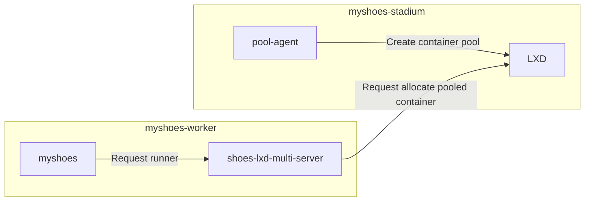

# Pool Agent

Stadium Agent for pool mode

## Setup

### configuration file

configuration file format is toml

```toml
# sample configuration
[[resource_types_map]]
name = "large"
cpu = 2
memory = "20GB"
[[resource_types_map]]
name = "xlarge"
cpu = 4
memory = "40GB"
[[resource_types_map]]
name = "2xlarge"
cpu = 8
memory = "80GB"
[[resource_types_map]]
name = "3xlarge"
cpu = 12
memory = "120GB"
[[resource_types_map]]
name = "4xlarge"
cpu = 16
memory = "160GB"
[config.ubuntu2404]
image_alias = "https://example.com/container-image-noble"
[config.noble.resource_types_counts]
large = 1
xlarge = 1
2xlarge = 1
3xlarge = 1
4xlarge = 1
[config.ubuntu2204]
image_alias = "https://example.com/container-image-jammy"
[config.focal.resource_types_counts]
large = 1
xlarge = 1
2xlarge = 1
3xlarge = 1
4xlarge = 1
```

### command line options

```bash
$ pool-agent --help
Usage:
  pool-agent [command]

Available Commands:
  completion  Generate the autocompletion script for the specified shell
  help        Help about any command
  run

Flags:
      --config string    config file path (default "/etc/pool-agent/config.toml")
  -h, --help             help for pool-agent
      --metrics string   metrics file path (default "/var/lib/node_exporter/textfile_collector/pool_agent.prom")

Use "pool-agent [command] --help" for more information about a command.
```

### Optional values

- `LXD_MULTI_CHECK_INTERVAL`
    - Interval to check instances
    - default: `2s`
- `LXD_MULTI_WAIT_IDLE_TIME`
    - Duration to wait instance idle after `systemctl is-system-running --wait`
    - default: `5s`
- `LXD_MULTI_ZOMBIE_ALLOW_TIME`
    - Duration to delete zombie instances after instance created
    - default: `5m`


